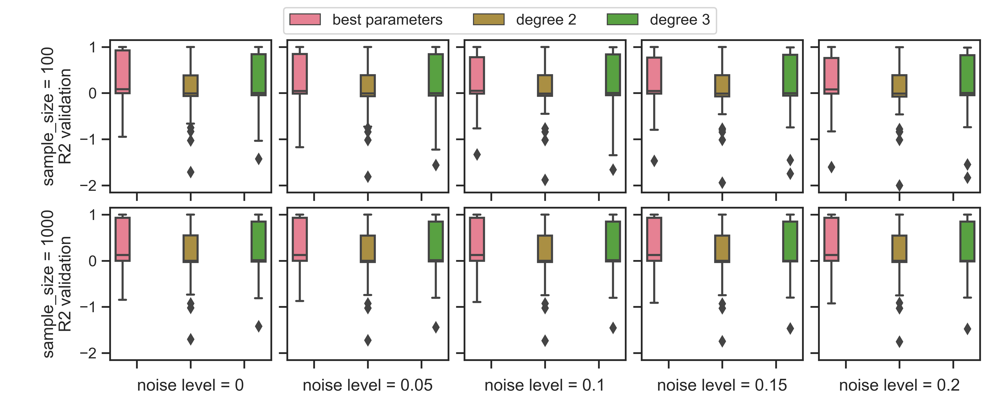

# Shape-Constrained Regression (SCR) Benchmarks
This repository serves as a benchmark suite for shape-constrained regression algorithms, which can integrate prior knowledge about the expected shape of the prediction function.

Our benchmark suite builds upon [established benchmarks for symbolic regression](#credit) and extends them in functionality. We provide python code for generating training data for experiments, a set of validation datasets for result comparison, and the ability to check if a function adheres to the specified constraints.

Additionally, we provide the code and platform to compare to other shape-constrained regression algorithms by hosting up-to-date comparison charts and linking to other algorithms and their respective publications (if available).


## Usage

See our `examples` folder for **more code snippets and usage examples**. There we detail the [data sampling](/examples/generate_data.ipynb) methodology and show how to use our [constraint checking](examples/checking_constraints.ipynb) interface. This README only highlights the key features.


### Generate Benchmark Data
Go [here](/examples/generate_data.ipynb) for more examples.
```python
from SCRBenchmark import FEYNMAN_SRSD_HARD,HARD_NOISE_LEVELS,HARD_SAMPLE_SIZES
from SCRBenchmark import BenchmarkSuite

#creates one folder per equation under the parent folder
# each equation folder contains the info file as json
# and the data files for each configuration as csv
BenchmarkSuite.create_hard_instances(target_folder = './data',
                                        Equations=FEYNMAN_SRSD_HARD,
                                        sample_sizes=HARD_SAMPLE_SIZES,
                                        noise_levels=HARD_NOISE_LEVELS)
```

### Generate Benchmark Data for individual equations
Go [here](/examples/generate_data.ipynb) for more examples.
```python
import SCRBenchmark.SRSDFeynman as srsdf
from SCRBenchmark import Benchmark

ICh6Eq20 = Benchmark(srsdf.FeynmanICh6Eq20)
(training, test) = ICh6Eq20.create_dataset(sample_size=1000, patience= 10, noise_level = 0)
```

### Check if functions adhere to constraints
Go [here](examples/checking_constraints.ipynb) for more detail.
```python
import SCRBenchmark.SRSDFeynman as srsdf
from SCRBenchmark import Benchmark

ICh6Eq20 = Benchmark(srsdf.FeynmanICh6Eq20)
# Raw: exp(-(theta / sigma) ** 2 / 2) / (sqrt(2 * pi) * sigma)
# is monotonic increasing over theta in -inf. <= theta <= 0
# is monotonic decreasing over theta in 0 <= theta <= inf.

#prints true as no constraint is violated
print(ICh6Eq20.check_constraints("-(theta*theta)",use_display_names=True))

#prints false as the decreasing constraint for 0 <= theta <= inf. is violated
print(ICh6Eq20.check_constraints("theta",use_display_names=True))

#prints false as the increasing constraint for -inf. <= theta <= 0 is violated
print(ICh6Eq20.check_constraints("-theta",use_display_names=True))

#prints false as both constraints for x0 (theta) are violated
print(ICh6Eq20.check_constraints("(theta*theta)",use_display_names=True))
```

## Results
We will continuously report on results using benchmark set. Currently, only results using shape-constrained polynomial regression (SCPR) are available. We run this algorithm with three different settings to showcase how comparison of algorithms will look like in the future. The detailed results of SCPR are published in our separate [SCR-Benchmark SCPR result repository](https://github.com/florianBachinger/SCR-Benchmark-SCPR). The methodology and experimental setup are described in our publication.


Image shows the validation $R^2$ for different training set sizes and noise levels present in the training data. The training data is generated using provided seeds to assure fair comparison over all benchmark instances. The validation dataset is fixed and included in this repository and its python package. There is no noise present in the validation data. 

| Approach |Description | URL |
|----------|------------|-----|
|SCPR | shape-constrained polynomial regression | [SCPR result repository](https://github.com/florianBachinger/SCR-Benchmark-SCPR) |

## Installation 

### pip install

If the python package is hosted on a repository, you can install directly using:

```sh
pip install git+https://github.com/florianBachinger/SCR-Benchmarks-NIPS.git
```
(you may need to run `pip` with root permission: `sudo pip install git+https://github.com/florianBachinger/SCR-Benchmarks-NIPS.git`)

Then import the package:
```python
import SCRBenchmark
```

## References

### Citations
Cite this work:

```bibtex
will be added in future
```

### Credit
We enhance the work of Matsubara et al. by determining the _shape constraints_ that describe the expected function shapes of the benchmark formulas. This knowledge can be used to enforce the behavior of trained prediction models and to e.g., improve extrapolation behavior.


Credit to Matsubara et al. for reviewing and adapting the formulas and variable ranges of Udrescu et al. to reasonable sampling values:
```bibtex
@article{Matsubara2022,
  title={Rethinking Symbolic Regression Datasets and Benchmarks for Scientific Discovery},
  author={Matsubara, Yoshitomo and Chiba, Naoya and Igarashi, Ryo and Tatsunori, Taniai and Ushiku, Yoshitaka},
  journal={arXiv preprint arXiv:2206.10540},
  year={2022}
}
```

Credit to Udrescu et al. for the initial benchmark set:
```bibtex
@article{Udrescu2020,
  title={AI Feynman: A physics-inspired method for symbolic regression},
  author={Udrescu, Silviu-Marian and Tegmark, Max},
  journal={Science Advances},
  volume={6},
  number={16},
  pages={eaay2631},
  year={2020},
  publisher={American Association for the Advancement of Science}
}
```